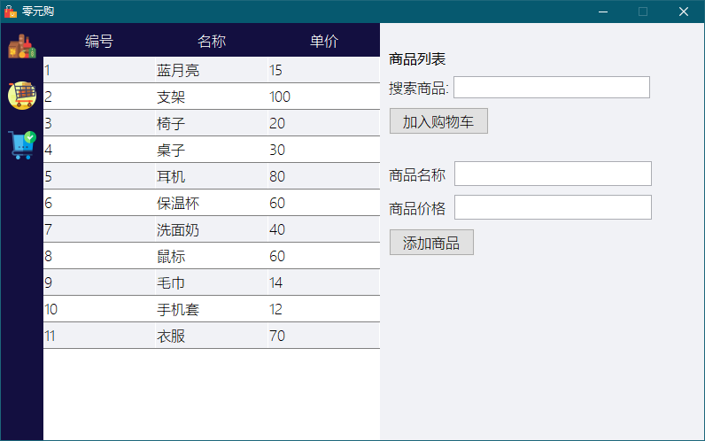
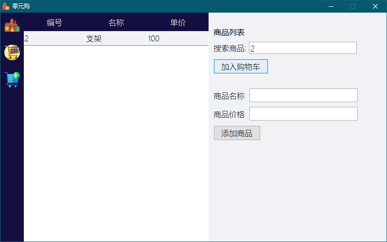
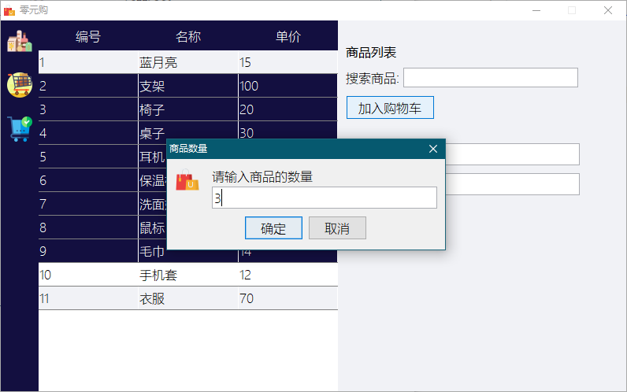
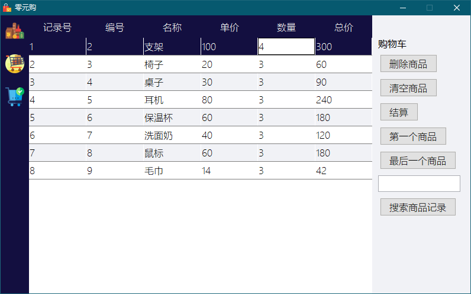
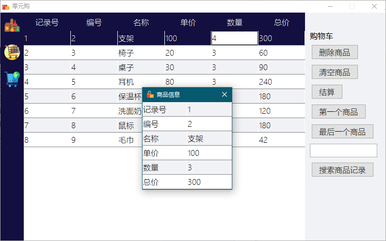
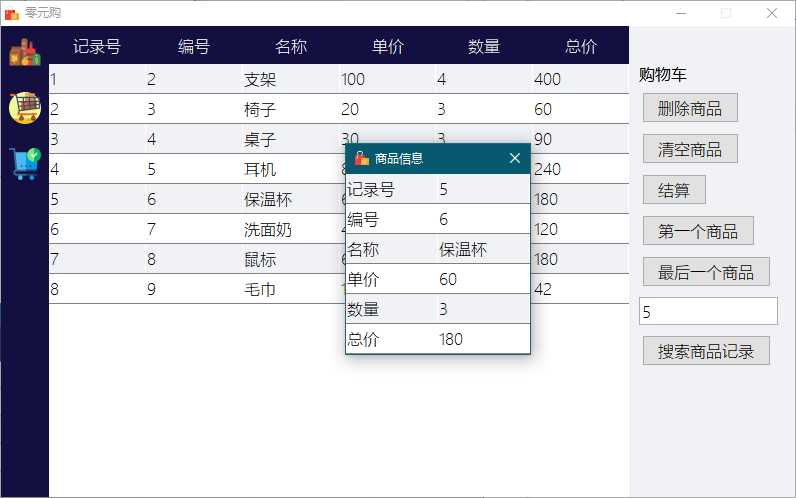
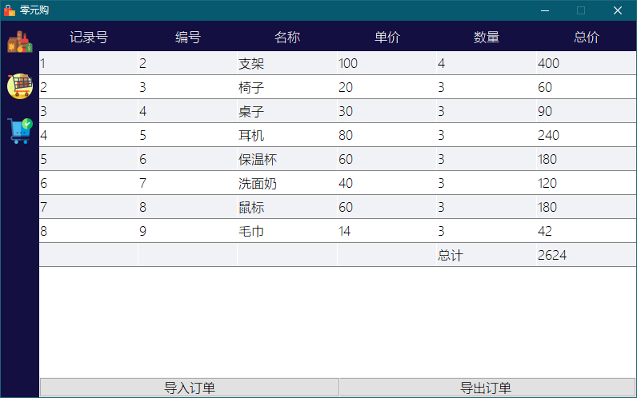
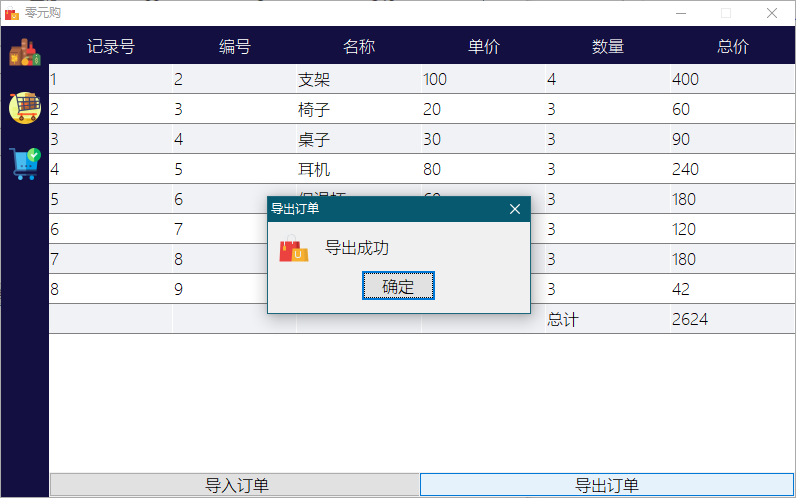
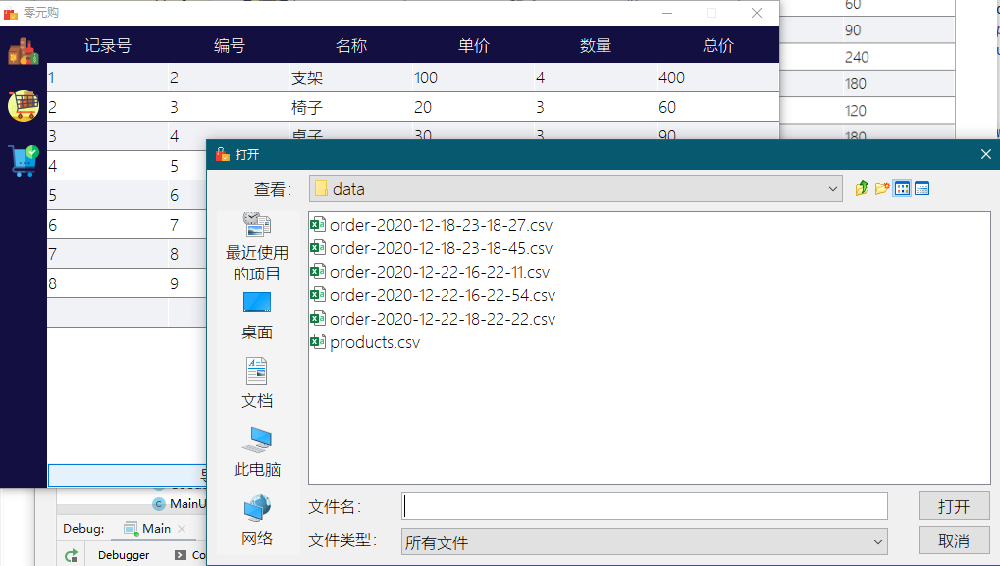

#### 2020.12.22(最终)  Java 实验二作业

#### 零元购（模拟微商城）

#### Debug环境

系统: Window 10 2004 (理论上可跨平台，但是不保证样式)

开发语言: Java 1.6（Win10 高分辨率请选择1.8及以上版本，保证可正常放缩）

IDE: Idea 2020.3

#### 需求分析：

1．用户可以添加购买一种商品，添加的信息包括商品名称、数量和单价

2．用户可以删除已购买的一种商品

3．用户可以查询已购买的一种商品的详细信息，查询时要指明查询的商品的记录号是多少（商品记录号是按照商品购买次序编的），还可以指定查询第一个或最后一个购买的商品信息。

4．用户可以删除所有已添加到购物车的商品

#### UI风格

非常简陋版

#### 编程思想

MVVM???草稿

#### Demo

商城界面（自动从文件中加载商品）

动态搜索商品

批量添加到购物车

购物车可动态修改商品数量

第一个商品

搜索购物车记录

结算

导出订单

导入订单

